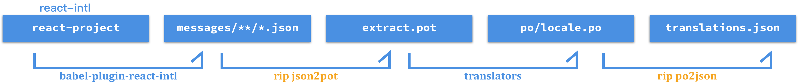

# react-intl-po

> Extract POT from react-intl and convert back to json.
>
> messages.json → POT → PO → translation.json

[![Travis][build-badge]][build]
[![Codecov Status][codecov-badge]][codecov]
[![npm package][npm-badge]][npm]
[![npm downloads][npm-downloads]][npm]

[![Dependency Status][dependency-badge]][dependency]
[![devDependency Status][devdependency-badge]][devdependency]
[![peerDependency Status][peerdependency-badge]][peerdependency]

[![license][license-badge]][license]
[](https://github.com/prettier/prettier)

## Tutorial

Please take a look at standalone repo based on Create-React-App: https://github.com/evenchange4/react-intl-po-example

## Installation

```sh
$ yarn add react-intl-po
```

## Requirements and Workflow

* [react-intl](https://github.com/yahoo/react-intl) `^2.0.0`
* [babel-plugin-react-intl](https://github.com/yahoo/babel-plugin-react-intl) `^2.0.0`



## Usage

There are two sub-commands of `react-intl-po` or `rip`:

1.  json2pot: Convert the json files extracted from _babel-plugin-react-intl_ into one `.pot` file.
2.  po2json: Convert translated _.po_ files back to `.json` format.

### json2pot

```sh
$ rip json2pot '_translations/src/**/*.json' \
    -o ./mcs-public.pot
```

| **Arguments**                     | **Description**                                                       |
| --------------------------------- | --------------------------------------------------------------------- |
| `srcPatterns`                     | The pattern of _.json_ files extracted from _babel-plugin-react-intl_ |
| `-o, --output <path>`             | The output pathname of _.pot_ file to be translated                   |
| `-k, --message-key [key]`         | [Optional] Translation message key (default key is `defaultMessage`)  |
| `-c, --message-context [context]` | [Optional] Translation message context (defaults to no context)       |

### po2json

#### Case 1: Output one file per locale if a `directory` is set

```sh
$ rip po2json './node_modules/mcs-translation/po/mcs-public*.po' \
     -m './_translations/src/**/*.json' \
     -o './translations'
```

#### Case 2: Output one merged file if a `.json file` is set

```sh
$ rip po2json './node_modules/mcs-translation/po/mcs-public*.po' \`
     -m './_translations/src/**/*.json' \
     -o './translations.json'
```

| **Arguments**                             | **Description**                                                                                                                                                                                                                                   |
| ----------------------------------------- | ------------------------------------------------------------------------------------------------------------------------------------------------------------------------------------------------------------------------------------------------- |
| `srcPatterns`                             | The pattern of translated _.po_ files                                                                                                                                                                                                             |
| `-m, --messages-pattern <path>`           | The pattern of _.json_ files extracted from _babel-plugin-react-intl_                                                                                                                                                                             |
| `-o, --output <path>`                     | The output pathname of a file / directory                                                                                                                                                                                                         |
| `-k, --message-key [key]`                 | [Optional] Translation message key (default key is `defaultMessage`)                                                                                                                                                                              |
| `-c, --message-context [context]`         | [Optional] Translation message context (defaults to no context)                                                                                                                                                                                   |
| `-l, --lang-mapper-pattern <pattern>`     | [Optional] Custom regex to use for lang mapping. [PR#122](https://github.com/evenchange4/react-intl-po/pull/122)                                                                                                                                  |
| `-i, --lang-mapper-pattern-index [index]` | [Optional] When specifying a custom lang-mapper-pattern, the index of match to use for the lang mapping. Default is 1, index is ignored if not using a custom lang mapping regex. [PR#122](https://github.com/evenchange4/react-intl-po/pull/122) |
| `--indentation <number|char>`             | [Optional] Specify a number of spaces or a set of characters to be used before each entry of the resulting json file. Defaults to `null`, which means the entries are not prefixed with spaces.                                                   |

## Property

## Q&A

### How to translate the same message into two different meanings?

#### Option 1 (Recommended):

Set the `message-context (-c)` to `'id'` of message object from _babel-plugin-react-intl_ (there is no context by default).

The advantage of this option over Option 2 (below) is that PO file editors that provide features such as translation suggestions or error-checking often expect the message key to be `defaultMessage`.

```sh
$ rip po2json './node_modules/mcs-translation/po/mcs-public*.po' \
     -m './_translations/src/**/*.json' \
     -o './translations' \
     -c 'id'

$ rip po2json './node_modules/mcs-translation/po/mcs-public*.po' \`
    -m './_translations/src/**/*.json' \
    -o './translations.json' \
    -c 'id'
```

Example: https://github.com/evenchange4/react-intl-po-example#option

#### Option 2: [Maybe deprecated next major release]

Set the `message-key (-k)` to `'id'` of message object from _babel-plugin-react-intl_ (default key is `'defaultMessage'`). ([#41](https://github.com/evenchange4/react-intl-po/pull/41))

```sh
$ rip po2json './node_modules/mcs-translation/po/mcs-public*.po' \
     -m './_translations/src/**/*.json' \
     -o './translations' \
     -k 'id'

$ rip po2json './node_modules/mcs-translation/po/mcs-public*.po' \`
    -m './_translations/src/**/*.json' \
    -o './translations.json' \
    -k 'id'
```

## Development

```sh
$ yarn install --pure-lockfile
```

### Ramda.js

You can use `R.tap()` for developing.

```diff
R.pipe(
  R.concat(...),
+ R.tap(e => console.log(e)),
  R.mergeAll,
);
```

### Requirements

* node >= 9.11.1
* yarn >= 1.5.1

### Test

```sh
$ yarn run format
$ yarn run eslint
$ yarn run test:watch
```

### NPM Release

> Any git tags.

1.  Create a new git tag
2.  Update `CHANGELOG.md`

```sh
$ npm version patch
```

---

## CONTRIBUTING

* ⇄ Pull requests and ★ Stars are always welcome.
* For bugs and feature requests, please create an issue.
* Pull requests must be accompanied by passing automated tests (`$ yarn run test`).

## [CHANGELOG](CHANGELOG.md)

## [LICENSE](LICENSE)

MIT: [http://michaelhsu.mit-license.org](http://michaelhsu.mit-license.org)

[build-badge]: https://img.shields.io/travis/evenchange4/react-intl-po/master.svg?style=flat-square
[build]: https://travis-ci.org/evenchange4/react-intl-po
[npm-badge]: https://img.shields.io/npm/v/react-intl-po.svg?style=flat-square
[npm]: https://www.npmjs.org/package/react-intl-po
[codecov-badge]: https://img.shields.io/codecov/c/github/evenchange4/react-intl-po.svg?style=flat-square
[codecov]: https://codecov.io/github/evenchange4/react-intl-po?branch=master
[npm-downloads]: https://img.shields.io/npm/dt/react-intl-po.svg?style=flat-square
[license-badge]: https://img.shields.io/npm/l/react-intl-po.svg?style=flat-square
[license]: http://michaelhsu.mit-license.org/
[dependency-badge]: https://david-dm.org/evenchange4/react-intl-po.svg?style=flat-square
[dependency]: https://david-dm.org/evenchange4/react-intl-po
[devdependency-badge]: https://david-dm.org/evenchange4/react-intl-po/dev-status.svg?style=flat-square
[devdependency]: https://david-dm.org/evenchange4/react-intl-po#info=devDependencies
[peerdependency-badge]: https://david-dm.org/evenchange4/react-intl-po/peer-status.svg?style=flat-square
[peerdependency]: https://david-dm.org/evenchange4/react-intl-po#info=peerDependencies
